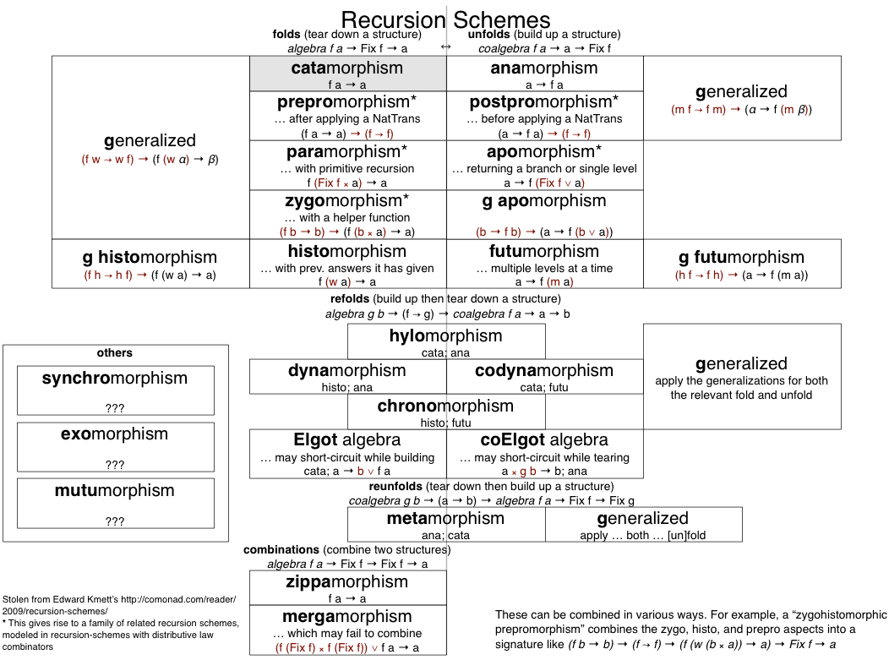
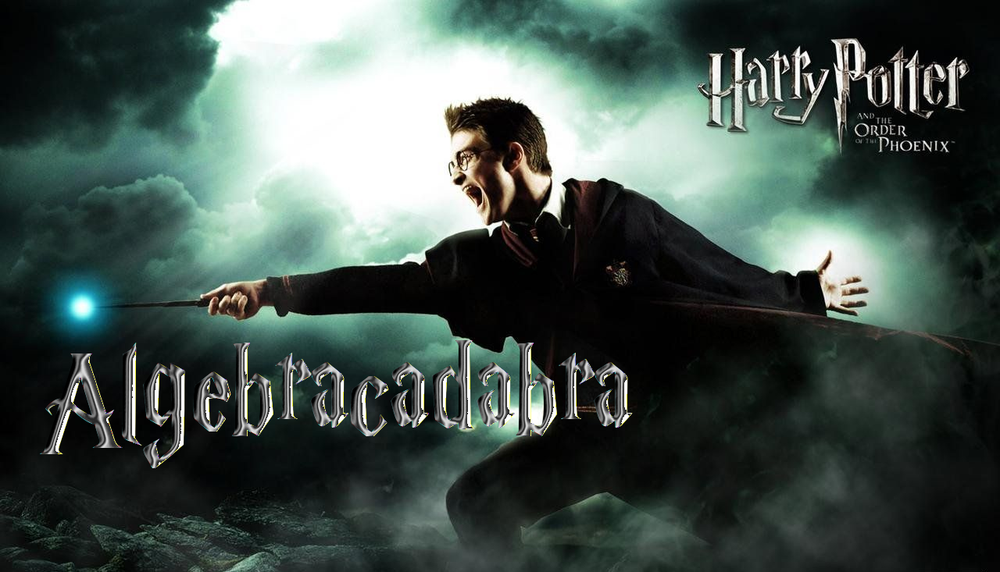
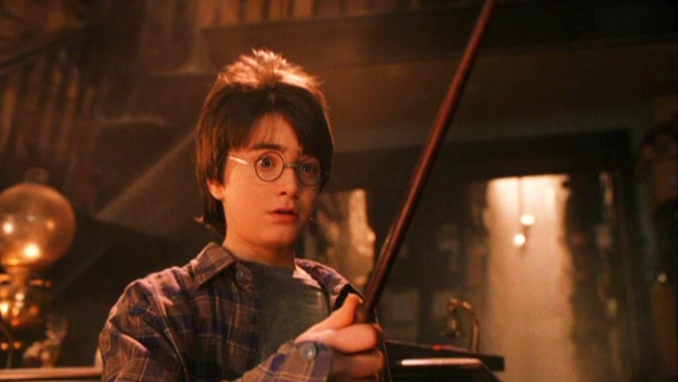

<script src='https://cdnjs.cloudflare.com/ajax/libs/mathjax/2.7.5/MathJax.js?config=TeX-MML-AM_CHTML' async></script>

# Schémas de Récursions

<h3><p style="text-align:left;"><span style="color: red;">- Déluge de Buzz Words façon Michael Bay</span><br/>
    <span style="color: green;">+ Comprendre c'est bien aussi</span>
    </p>
</h3>

**PSUG - 28 Mars 2019**

*Christophe Calvès* [@chrilves](https://twitter.com/chrilves) / [MFG Labs](http://mfglabs.com/)

Article [Recursion Schemes: the high-school introduction](https://chrilves.github.io/hugo/posts/recursion_schemes_intro/)
sur https://chrilves.github.io

---

##### Au Cinéma



----



----

##### Dans la réalité



> **Derrière toute maîtrise, il y a de longues heures passées à acquérir les bases.**

---

### Dans *Schéma de Récursion*, il y a *Récursion*

$$\forall n\in \\{ 0,1,\cdots \\} \quad fact(n) = 1 \times 2 \times 3 \times \cdots \times (n-1) \times n$$

```scala
def fact(n: Int): Int =
  if (n == 0) 1
  else {
    val r = fact(n-1)
    r * n
  }
```

*Objectif*: **Isoler la logique de récursion du reste du code**


----

### Savoir faire la part des choses

```scala
def fact(n: Int): Int =
  if (n == 0) 1
  else {
    val r = fact(n-1)
    r * n
  }
```

devient

```scala
val baseCase: Int = 1
def recCase(r: Int, n: Int): Int = r * n

def fact(n: Int): Int =
  if (n == 0) baseCase
  else {
    val r = fact(n-1)
    recCase(r, n)
  }
```

----

### Autre exemple

```scala
def sum( n: Int): Int =
  if (n == 0) 0
  else {
    val r = sum( n-1)
    r + n
  }
```

devient

```scala
val baseCase: Int = 0
def recCase(r: Int, n: Int): Int = r + n

def sum( n: Int): Int =
  if (n == 0) baseCase
  else {
    val r = sum( n-1)
    recCase(r, n)
  }
```

----

### Le Schéma

```scala
def scheme(baseCase: Int, recCase: (Int, Int) => Int): Int => Int = {

  def commonRecursiveRelevantPart(n: Int): Int =
    if (n == 0) baseCase
    else {
      val r = commonRecursiveRelevantPart(n-1)
      recCase(r, n)
    }
  
  commonRecursiveRelevantPart
}
```

Définir `fact` et `sum` revient à donner `baseCase` et `recCase`

```scala
def fact: Int => Int = scheme(1, (r: Int, n:Int) => r * n)
def sum : Int => Int = scheme(0, (r: Int, n:Int) => r + n)
```

<span style="color: red;">Correct mais **risque de stack-overflow**.</span>

----

### Même interface mais meilleure implem

- Avant:

```scala
def scheme(baseCase: Int, recCase: (Int, Int) => Int): Int => Int = {
  def commonRecursiveRelevantPart(n: Int): Int =
    if (n == 0) baseCase
    else {
      val r = commonRecursiveRelevantPart(n-1)
      recCase(r, n)
    }
  commonRecursiveRelevantPart
}
```

- Après:

```scala
def scheme(baseCase: Int, recCase: (Int, Int) => Int)(n: Int): Int = {
  var res = baseCase
  var i: Int = 1
  while (i <= n) {
    res = recCase(res, i)
    i += 1
  }
  res
}
```

----

# Mais ils sont où les SFX!?

- Le code impératif est souvent plus rapide ...
- ... mais aussi plus dur à écrire (et donc plus buggué)!
- Besoin d'écrire le schéma qu'une seule fois.
- Réutilisation massive du schéma.

---

### Pour marcher il faut faire un premier pas
### puis un second

- $fib(0) = 1$
- $fib(1) = 1$
- $fib(n+2) = fib(n+1) + fib(n)$

```scala
def fib(n: Int): Int =
  n match {
    case 0 => 1
    case 1 => 1
    case n =>
      val r1 = fib(n-1)
      val r2 = fib(n-2)
      r1 + r2
  }
```

----

### Isolation de la logique récursive

```scala
def fib(n: Int): Int =
  n match {
    case 0 => 1
    case 1 => 1
    case n =>
      val r1 = fib(n-1)
      val r2 = fib(n-2)
      r1 + r2
  }
```

```scala
val baseCase0: Int = 1
val baseCase1: Int = 1
def recCase(r1: Int, r2: Int): Int = r1 + r2

def fib(n: Int): Int =
  n match {
    case 0 => baseCase0
    case 1 => baseCase1
    case n =>
      val r1 = fib(n-1)
      val r2 = fib(n-2)
      recCase(r1, r2)
  }
```

----

### Le Schéma


```scala
def scheme(baseCase0:Int, baseCase1:Int, recCase:(Int,Int) => Int)(n:Int): Int =
  n match {
    case 0 => baseCase0
    case 1 => baseCase1
    case n =>
      val r1 = fib(n-1)
      val r2 = fib(n-2)
      recCase(r1, r2)
  }
```

```scala
def scheme(baseCase0:Int, baseCase1:Int, recCase:(Int,Int) => Int)(n:Int): Int =
  if (n == 0) baseCase0
  else {
    var b0 = baseCase0
    var b1 = baseCase1
    var i = 2
    while (i <= n) {
      val b2 = recCase(b0, b1)
      b0 = b1
      b1 = b2
      i += 1
    }
    b1
  }
```

---

# Tout ça pour ça ???

```scala
def scheme   (baseCase: Int, recCase: (Int, Int) => Int)(n: Int): Int = {
  var res = baseCase
  var i: Int = 1
  while (i <= n) {
    res = recCase(res, i)
    i += 1
  }
  res
}
```

```scala
def fact: Int => Int =
  scheme(1  , (r: Int      , n: Int) => r *  n )
```

```scala
fact(5) = 120
```

----

# Non !!!

```scala
def scheme[A](baseCase: A  , recCase: (A  , Int) => A  )(n: Int): A   = {
  var res = baseCase
  var i: Int = 1
  while (i <= n) {
    res = recCase(res, i)
    i += 1
  }
  res
}
```

```scala
def list: Int => List[Int] =
  scheme(Nil, (r: List[Int], n: Int) => r.+:(n))
```

```scala
list(5) = List(5, 4, 3, 2, 1)
```

----

# Fibonacci

Le schéma général

```scala
def scheme[A](baseCase0: A, baseCase1: A, recCase: (A, A) => A)(n: Int): A
```

Petit exemple:

```scala
sealed abstract class Tree[+A]
final case class Leaf[+A](value: A) extends Tree[A]
final case class Node[A](left: Tree[A], right: Tree[A]) extends Tree[A]

def tree: Int => Tree[Boolean] =
  scheme(
    Leaf(false),
    Leaf(true),
    (r1: Tree[Boolean], r2: Tree[Boolean]) => Node(r1,r2)
  )
```

---

# Et les buzz words dans tout ça ?

----

### Juste une affaire de présentation

- Met l'accent sur le schéma:

  ```scala
  def scheme[A](
      baseCase: A,                                            
      recCase: (A, Int) => A
    ): Int => A
  ```

- Met l'accent sur la structure de `A`:

  ```scala
  trait AkolovioaAlgebra[A] {
    val initial: A
    def action(r: A, n: Int): A
  }
  def akolovioaMorphism[A: AkolovioaAlgebra]: Int => A
  ```

- Les deux formes sont équivalentes.

---

> L'apprentissage c'est comme en Rallye: pour allez loin, apprenez à ne pas aller trop vite.

<video width="50%" src="accident.mp4" autoplay loop="true" playsinline controls></video>

- Les définitions avancées naissent de la **pratique des bases**, pas l'inverse!
- N'y voyez **pas un catalogue** mais des pistes d'**expérimentation**.
- Développez votre compréhension par des **exemples jouets** comme ici.

---

# Schémas de Récursions

<h3><p style="text-align:left;"><span style="color: red;">- Déluge de Buzz Words façon Michael Bay</span><br/>
    <span style="color: green;">+ Comprendre c'est bien aussi</span>
    </p>
</h3>

*Christophe Calvès* [@chrilves](https://twitter.com/chrilves) / [MFG Labs](http://mfglabs.com/)

Article [Recursion Schemes: the high-school introduction](https://chrilves.github.io/hugo/posts/recursion_schemes_intro/)
sur https://chrilves.github.io


**Merci! Questions?**
